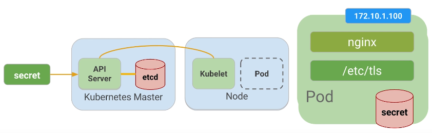

# Udacity: Scalable Microservices with Kubernetes

https://classroom.udacity.com/courses/ud615

## Introduction to Microservices

### The Evolution of Applications w/ Adrian Cockroft

Microservices: Breaking software into smaller pieces in containers.
- allows faster deployment of containerized
- smaller deployments => localized bugs that doesn't block entire org
- allow teams to work at different paces

*Don't* coordinate dependencies. Allow independent deployment cycles

### Microservices

Microservices := architecture approach to make software
- modular
- easy to deploy
- scale independently

### Setup GCE and Enable Cloud Shell

In this section you will create a Google Compute Engine (GCE) account.
GCE will allow you to the create VMs, Networks, and Storage volumes required
for this workshop.

GCE also provides the [Cloud Shell](https://cloud.google.com/shell/docs)
computing environment that will be used complete the labs.

#### Create a GCE Account

A Google Cloud Platform account is required for this course. You can use an
existing GCP account or [sign up for a new
one](https://console.cloud.google.com/freetrial) with a valid Gmail account.

A credit card is required for Google Cloud Platform, but there is no
subscription cost, you pay only for resources you use.

#### Create a Project

A GCP project is required for this course. You can use an existing GCP project or [create a new one](https://support.google.com/cloud/answer/6251787).

Your project name maybe different from your project id.

#### Enable Compute Engine and Container Engine APIs

In order to create the cloud resources required by this workshop, you will need to enable the following APIs using the [Google API Console](https://developers.googleblog.com/2016/03/introducing-google-api-console.html):
*   **Compute Engine API**
*   **Container Engine API**

#### Enable and explore Cloud Shell

[Google Cloud Shell](https://cloud.google.com/shell/docs) provides you with
command-line access to computing resources hosted on Google Cloud Platform and
is available now in the Google Cloud Platform Console. Cloud Shell makes it
easy for you to **manage your Cloud Platform Console projects and resources
without having to install the Google Cloud SDK and other tools on your
system**. With Cloud Shell, the Cloud SDK gcloud command and other utilities
you need are always available when you need them.

##### Explore Google Cloud Shell

Visit the [Google Cloud Shell getting started
guide](https://cloud.google.com/shell/docs/quickstart) and work through the
exercises.

##### Configure Your Cloud Shell Environment

Create two Cloud Shell Sessions and run the following commands to avoid setting
the compute zone.

List available time zones:

    gcloud compute zones list

Set a time zone example:

    gcloud config set compute/zone europe-west1-d

#### Download Go:

**Note**: Cloud Shell comes with an installed Go, but it's not the most recent
version, so you should perform the steps below to install the latest Go and set
GOPATH.

    wget https://storage.googleapis.com/golang/go1.6.2.linux-amd64.tar.gz
    sudo rm -rf /usr/local/go
    sudo tar -C /usr/local -xzf go1.6.2.linux-amd64.tar.gz
    echo "export GOPATH=~/go" >> ~/.bashrc
    source ~/.bashrc

Get the code:

    mkdir -p $GOPATH/src/github.com/udacity
    cd $GOPATH/src/github.com/udacity
    git clone https://github.com/udacity/ud615

### Build and Interact with Monolith

Sample app is running 3 services
- Monolith
- Hello
- Auth Service

Note: Monolith is self-contained. Check `/vendor`

##### On shell 1 - build the app:

Make sure you are in the app directory and build the app:

    cd $GOPATH/src/github.com/udacity/ud615/app
    mkdir bin

    go build -o ./bin/monolith ./monolith

Optional - if you run into errors building your go binaries, you probably need to install the dependencies first by running:

    $ go get -u 

##### On shell 1 - run the monolith server:

    sudo ./bin/monolith -http :10080

##### On shell 2 - test the app:

    curl http://127.0.0.1:10080

    curl http://127.0.0.1:10080/secure

##### On shell 2 - authenticate (password is password):

    curl http://127.0.0.1:10080/login -u user

It prints out the token.

You can copy and paste the long token in to the next command manually, but
copying long, wrapped lines in cloud shell is broken. To work around this, you
can either copy the JWT token in pieces, or - more easily - by assigning the
token to a shell variable as follows

##### On shell 2 - login and assign the value of the JWT to a variable

    TOKEN=$(curl http://127.0.0.1:10080/login -u user | jq -r '.token')

Check that it worked:

    echo $TOKEN

##### On shell 2 - access the secure endpoint using the JWT:

    curl -H "Authorization: Bearer $TOKEN" http://127.0.0.1:10080/secure

##### On shell 2 - check out dependencies

    ls vendor 
    cat vendor/vendor.json

### 12 Facter

Best practice for building SaaS
- portable
- deployable: e.g. aws, gcp
- continually deployable
- scalable: to user demand

### Refactor to MSA

Shell 1 - build and run the hello service

    go build -o ./bin/hello ./hello

    sudo ./bin/hello -http 0.0.0.0:10082

Shell 2 - build and run the auth service

    go build -o ./bin/auth ./auth

    sudo ./bin/auth -http :10090 -health :10091

Shell 3 - interact with the auth and hello microservices

    TOKEN=$(curl 127.0.0.1:10090/login -u user | jq -r '.token')

    curl -H "Authorization:  Bearer $TOKEN" http://127.0.0.1:10082/secure

### JWT: JSON Web Tokens

JWT := compact self contained method for transferring secure data as a JSON

Uses
- Authentication
- Information Exchange

To test a token paste it in [jwt.io](https://jwt.io)

How does it work?
- client sends auth request to server
- server generates token
- server returns token to client
- client submits request with token
- server verifies the token
- server returns payload

## Building the Containers with Docker

### Installing apps with native OS tools

Cloud shell - set compute/zone
- Google Cloud shell is an ephemeral instance and will reset if you don't use it for more than 30 minutes. That is why you might have to set some configuration values again

    gcloud compute zones list
    gcloud config set compute/zone <zone>

Cloud shell - launch a new VM instance

    gcloud compute instances create ubuntu \
    --image-project ubuntu-os-cloud \
    --image ubuntu-1604-xenial-v20160420c 

Cloud shell - log into the VM instance

    gcloud compute ssh ubuntu

VM instance - update packages and install nginx

    sudo apt-get update
    sudo apt-get install nginx
    nginx -v

VM instance - start nginx

    sudo systemctl start nginx

Check that it's running

    sudo systemctl status nginx

    curl http://127.0.0.1

### Container Overview

Solve for installing and running apps across multiple environments
- independent packages
- namespace isolation

### Installing Images with Docker

    sudo apt-get install docker.io

Check Docker images

    sudo docker images

Pull nginx image

    sudo docker pull nginx:1.10.0

    sudo docker images

Verify the versions match

  sudo dpkg -l | grep nginx

If your version of nginx from native package and Docker are different, you need 
to update the VM instance:

    sudo apt-get update
    sudo apt-get install nginx

### Running Images with Docker

Run the first instance

    sudo docker run -d nginx:1.10.0

Check if it's up

    sudo docker ps

Run a different version of nginx

    sudo docker run -d nginx:1.9.3

Run another version of nginx

    sudo docker run -d nginx:1.10.0

Check how many instances are running

    sudo docker ps
    sudo ps aux | grep nginx

What's with the container names?

If you don't specify a name, Docker gives a container a random name, such as
"stoic_williams," "sharp_bartik," "awesome_murdock," or "evil_hawking."
(Stephen Hawking got no love on this one.)

These are generated from a list of adjectives and names of famous scientists
and hackers. The combination of the names and adjectives is random, except for
one case. Want to see what the exception is? Check it out in the [Docker source
code!](https://github.com/moby/moby/blob/master/pkg/namesgenerator/names-generator.go)

### Talking to Docker instances

List all running container processes

    sudo docker ps

For use in shell scripts you might want to just get a list of container IDs (-a
stands for all instances, not just running, and -q is for "quiet" - show just
the numeric ID):

    sudo docker ps -aq

Inspect the container

You can use either CONTAINER ID or NAMES field, for example for a `sudo docker
ps` output like this:

    CONTAINER ID        IMAGE               COMMAND                  CREATED             STATUS              PORTS               NAMES
    f86cf066c304        nginx:1.10.0        "nginx -g 'daemon off"   8 minutes ago       Up 8 minutes        80/tcp, 443/tcp     sharp_bartik

You can use either of the following commands:

    sudo docker inspect f86cf066c304
    # or
    sudo docker inspect sharp_bartik

Connect to the nginx using the internal IP

Get the internal IP address either copying from the full inspect file or by
assigning it to a shell variable:

    CN="sharp_bartik"
    CIP=$(sudo docker inspect --format '{{ .NetworkSettings.IPAddress }}' $CN)
    curl  http://$CIP

You can also get all instance IDs and their corresponding IP addresses by doing this:

    sudo docker inspect -f '{{.Name}} - {{.NetworkSettings.IPAddress }}' $(sudo docker ps -aq)

Stop an instance

    sudo docker stop <cid>
    # or
    sudo docker stop $(sudo docker ps -aq)

Verify no more instances running

    sudo docker ps

Remove the docker containers from the system

    sudo docker rm <cid>
    # or
    sudo docker rm $(sudo docker ps -aq)

### Creating your own images overview

Inspect `cat app/hello/Dockerfile` for a sample

`FROM alpine:3.1` to specify base image
- alpine is minimal and is used for official docker images

`MAINTAINER`

`ADD hello /usr/bin/hello` to add hello app to given path

`ENTRYPOINT ["hello"]` to specify which binary to run

### Create An Image

Install Go

    wget https://storage.googleapis.com/golang/go1.6.2.linux-amd64.tar.gz
    rm -rf /usr/local/bin/go
    sudo tar -C /usr/local -xzf go1.6.2.linux-amd64.tar.gz
    export PATH=$PATH:/usr/local/go/bin
    export GOPATH=~/go

Get the app code

    mkdir -p $GOPATH/src/github.com/udacity
    cd $GOPATH/src/github.com/udacity
    git clone https://github.com/udacity/ud615.git

Build a static binary of the monolith app

    cd ud615/app/monolith
    go get -u
    go build --tags netgo --ldflags '-extldflags "-lm -lstdc++ -static"'

Why did you have to build the binary with such an ugly command line?

You have to explicitly make the binary static. This is really important in the
Docker community right now because alpine has a different implementation of
libc. So your go binary wouldn't have had the lib it needed if it wasn't
static. You created a static binary so that your application could be
self-contained.

Create a container for the app

    cat Dockerfile

Build the app container

    sudo docker build -t monolith:1.0.0 .

List the monolith image

    sudo docker images monolith:1.0.0

Run the monolith container and get it's IP

    sudo docker run -d monolith:1.0.0
    sudo docker inspect <container name or cid>

or

    CID=$(sudo docker run -d monolith:1.0.0)
    CIP=$(sudo docker inspect --format '{{ .NetworkSettings.IPAddress }}' ${CID})

Test the container

    curl <the container IP>

or

    curl $CIP

Important note on security

If you are tired of typing "sudo" in front of all Docker commands, and confused
why a lot of examples don't have that, please read the following article about
implications on security [Why we don't let non-root users run Docker in CentOS,
Fedora, or
RHEL](http://www.projectatomic.io/blog/2015/08/why-we-dont-let-non-root-users-run-docker-in-centos-fedora-or-rhel/)

:caution: Do the same for `hello` and `auth` apps

### Public vs Private Registries

Registries:
- https://hub.docker.com/
- https://quay.io/
- https://cloud.google.com/container-registry/docs/

### Push Images

See all images

    sudo docker images

Docker tag command help

    docker tag -h

Add your own tag

    sudo docker tag monolith:1.0.0 <your username>/monolith:1.0.0

For example (you can rename too!)

    sudo docker tag monolith:1.0.0 udacity/example-monolith:1.0.0

Create account on Dockerhub

To be able to push images to Dockerhub you need to create an account there -
https://hub.docker.com/register/ Login and use the docker push command

    sudo docker login
    sudo docker push udacity/example-monolith:1.0.0

Repeat for all images you created - monolith, auth and hello!

## Kubernetes

### Deep Dive into Architecture

Challenges:
- conway's law: have to change org/arch practice
  - org bottlenecks become tech bottlenecks
- require more automation and systems that track changes

### What is Kubenetes

Kubernetes
- app config
- service discovery
- managing updates
- monitoring

Treat the cluster as a logical machine

### Setting up Kubernetes for this course

    cd $GOPATH/src/github/com/udacity/ud615/kubernetes

:caution: At any time you can clean up by running the `cleanup.sh` script

To complete the work in this course you going to need some tools. Kubernetes 
can be configured with many options and add-ons, but can be time consuming to 
bootstrap from the ground up. In this section you will bootstrap Kubernetes 
using Google Container Engine (GKE).

GKE is a hosted Kubernetes by Google. GKE clusters can be customized and 
supports different machine types, number of nodes, and network settings.

Use the following command to create your cluster for use for the rest of this 
course.

    gcloud container clusters create k0

### Kubernetes Intro Demo

Launch a single instance:

    kubectl run nginx --image=nginx:1.10.0

Get pods

    kubectl get pods

Expose nginx

    kubectl expose deployment nginx --port 80 --type LoadBalancer

List services

    kubectl get services

[Kubernetes command cheat 
sheet](http://kubernetes.io/docs/user-guide/kubectl-cheatsheet/)

### Pods Intro

**Pods** := logical application
- one or more containers and volumes
- provide shared namespace
- One IP per pod

      --------------------- 172.10.1.100 --------
      |                                         |
      |              ------------               |
      |            / |   nginx  |               |
      |           |  ------------               |
      |           |                             |
      |           |  ------------               |
      |            \ | monolith |               |
      |              ------------               |
      |  POD                                    |
      |      _____       _______       _____    |
      |     (_____)     (_______)     (_____)   |
      ------| GCE | --- | iSCSI | --- | NFS | ---
            -------     ---------     -------

### Creating Pods

Explore config file

    cat pods/monolith.yaml

Note the following
- `args`
- `ports`
- `resources`

Create the monolith pod

    kubectl create -f pods/monolith.yaml

Examine pods

    kubectl get pods

Use the kubectl describe command to get more information about the monolith 
pod.

    kubectl describe pods monolith

### Interacting with Pods

Pods cannot be accessed externally unless we `kubectl port-forward`

Cloud shell 1: set up port-forwarding

    kubectl port-forward monolith 10080:80

Open new Cloud Shell session 2

    curl http://127.0.0.1:10080

    curl http://127.0.0.1:10080/secure

Cloud shell 2 - log in

    curl -u user http://127.0.0.1:10080/login

    curl -H "Authorization: Bearer <token>" http://127.0.0.1:10080/secure

View logs

    kubectl logs -f monolith

In Cloud Shell 3

    curl http://127.0.0.1:10080

In Cloud Shell 2

    Exit log watching (Ctrl-C)

You can use the kubectl exec command to run an interactive shell inside the 
monolith Pod. This can come in handy when you want to troubleshoot from within 
a container:

    kubectl exec monolith --stdin --tty -c monolith /bin/sh

For example, once we have a shell into the monolith container we can test 
external connectivity using the ping command.

    ping -c 3 google.com

When youre done with the interactive shell be sure to logout.

    exit

### MHC (Moniting and Health Checks) Overview

[MHC User 
Guide](https://kubernetes.io/docs/tasks/configure-pod-container/configure-liveness-readiness-probes/)

See `cat pods/healthy-monolith.yaml` for config on how mhc is configured
- `readinessProbe`
- `livenessProbe`

    kubectl describe pods healthy-monolith | grep Readiness

    kubectl describe pods healthy-monolith | grep Liveness

### App Config and Security Overview

Config docs - http://kubernetes.io/docs/user-guide/configmap/

Secrets - http://kubernetes.io/docs/user-guide/secrets/
- `kubectl create secret generic tls-certs --from-file=tls/`
- ^ gets mounted in the pod at `/etc/tls`

### Creating Secrets

    ls tls

The cert.pem and key.pem files will be used to secure traffic on the monolith 
server and the ca.pem will be used by HTTP clients as the CA to trust. Since 
the certs being used by the monolith server where signed by the CA represented 
by ca.pem, HTTP clients that trust ca.pem will be able to validate the SSL 
connection to the monolith server.

#### Use kubectl

to create the tls-certs secret from the TLS certificates stored under the tls 
directory:

    kubectl create secret generic tls-certs --from-file=tls/

kubectl will create a key for each file in the tls directory under the 
tls-certs secret bucket. Use the kubectl describe command to verify that:

    kubectl describe secrets tls-certs

Next we need to create a configmap entry for the proxy.conf nginx configuration 
file using the kubectl create configmap command:

    kubectl create configmap nginx-proxy-conf --from-file=nginx/proxy.conf

Use the kubectl describe configmap command to get more details about the 
nginx-proxy-conf configmap entry:

    kubectl describe configmap nginx-proxy-conf

#### TLS and SSL

TLS and SSL can be confusing topics. Heres a good primer for understanding the 
basics: https://en.wikipedia.org/wiki/Transport_Layer_Security

### Accessing a Secure HTTPS Endpoint

    cat pods/secure-monolith.yaml

Note
- `lifecycle` to gracefully shutdown ngins
- `volumeMounts` to access secrets and configMaps
- `containers` to see we're running 2 containers

    kubectl create -f pods/secure-monolith.yaml

    kubectl get pods secure-monolith

    kubectl port-forward secure-monolith 10443:443

    curl --cacert tls/ca.pem https://127.0.0.1:10443

    kubectl logs -c nginx secure-monolith

### Services Overview

Services overview - http://kubernetes.io/docs/user-guide/services/
- stable endpoints for pods (ip might change when refreshed)

By defining a service, we can apply labels to pods and add functionality to 
them based on labels

    cat services/monolith.yaml

Note
- `kind: Service`
- `selector` find and expose pods with the labels `app`, `secure`
- `nodePort`

    kubectl create -f services/monolith.yaml

Set gcloud firewall rules to allow access by port

    gcloud compute firewall-rules create allow-monolith-nodeport --allow=tcp:31000

Check running gcloud instances and copy an external ip to test port forwarding

    gcloud compute instances list

The next command won't work because ...

    curl -k https://<external ip>:31000

### Adding Labels to Pods

    kubectl get pods -l "app=monolith"

    kubectl get pods -l "app=monolith,secure=enabled"

    kubectl label pods secure-monolith "secure=enabled"

Check label was applied

    kubectl describe pods secure-monolith |grep Labels

Check endpoinds

    kubectl describe pods secure-monolith |grep Endpoints

Now this curl command will work

    curl -k https://<external ip>:31000

### Lesson 3 Outro

## Deploying Microservices

### Deployment Overview

Deployments
- declarative way to drive current state towards desired state
- abstract low level details of managing pods

### Creating Deployments

    cat deployments/auth.yaml

Specify `replicas`, `labels`, `images`

Deploy auth

    kubectl create -f deployments/auth.yaml

    kubectl describe deployments auth

    kubectl create -f services/auth.yaml

Deploy hello

    kubectl create -f deployments/hello.yaml

    kubectl create -f services/hello.yaml

Configure nginx

    kubectl create configmap nginx-frontend-conf --from-file=nginx/frontend.conf

    kubectl create -f deployments/frontend.yaml

    kubectl create -f services/frontend.yaml

Grab external-ip

    kubectl get services frontend

    curl -k https://<external ip>

### Scaling Deployments

    kubectl get replicasets

To see how many replicats of hello app is running

    kubectl get pods -l "app=hello,track=stable"

Update `replicas` field to scale up

    vim deployments/hello.yaml

Update `replicas` field

Update the replicas

    kubectl apply -f deployments/hello.yaml

Look under `CURRENT` from output above

To see new replicas

    kubectl get pods

Check deployment updated to correct # of replicas

    kubectl describe deployment hello

Look at row `Replicas:`

We now have multiple copies of "hello"

### Rolling Updates

On update, `app v1` is rolled back one at a time and `app v2` comes online to 
replace each instance of v1

Modify the deployments

    vi deployments/auth.yaml

Update the `image` field to use `v2`
    
    kubectl apply -f deployments/auth.yaml

To view updates

    kubectl describe deployments auth 

Look at `RollingupdateStrategy` and `NewReplicaSet`
    
    kubectl get pods

Look at `AGE` to see that it's new

To verify auth pod is running new version of container 

    kubectl describe pods auth-<xxx>

## Resources

#### People

- Kelsey Hightower [@kelseyhightower](https://twitter.com/kelseyhightower)
- Carter Morgan [@\_askcarter](https://twitter.com/_askcarter)
- Adrian Cockcroft [@adrianco](https://twitter.com/adrianco)
- Gundega Dekena [@pytonc](https://twitter.com/pytonc)

#### Books

- [Kubernetes: Up and Running, Kelsey Hightower](http://shop.oreilly.com/product/0636920043874.do) The definitive book on Kubernetes. This has been a great resource while making this course.
- [Building Microservices: Defining Fine-Grained Systems](http://shop.oreilly.com/product/0636920033158.do) This is the book Kelsey reads before giving talks about microservices. Its that good.

#### Articles

- Martin Fowler on the [Pros](http://martinfowler.com/articles/microservices.html) and [Cons of Microservices](http://martinfowler.com/articles/microservice-trade-offs.html)
- [12-Fractured Apps](https://medium.com/@kelseyhightower/12-fractured-apps-1080c73d481c) - One of Carters favorites articles where Kelsey breaks down problems with many modern apps and how 12-factor app methodology solves those technical woes.
- Tim OReilly, ["Open Data: Small Pieces Loosely Joined"](http://radar.oreilly.com/2006/09/open-data-small-pieces-loosely.html) For the history nerds: Quite possibly the first article about Microservices Architecture (before it even had a name).

#### Videos

- Adrian Cockroft ["The Evolution of Microservices"](http://www.ustream.tv/recorded/86151804)
- Adrian Cockroft ["The State of the Art in Microservices"](https://www.youtube.com/watch?v=pwpxq9-uw_0) (docker specific)
- Martin Fowler ["Microservices"](https://www.youtube.com/watch?v=wgdBVIX9ifA) at goto
- Craig McLuckie ["The Next Chapter in Native Cloud Computing"](https://www.youtube.com/watch?v=mPhjFYXoAD0) on cloud-native computing as being: container-packaged, dynamically-scheduled, and microservices-oriented

#### Tools

The Go Programming Language
- Our app is written in Go. If youre not already using Go, you owe it to yourself to try it out.
- [https://golang.org/](https://golang.org/)

Google Cloud Shell
- A free temp VM preloaded with the tools need to manage our clusters.
- [https://cloud.google.com/shell/docs/](https://cloud.google.com/shell/docs/)

Docker
- We use Docker to package, distribute, and run our application.
- [https://www.docker.com/](https://www.docker.com/)

Kubernetes
- Once we have an application, we use Kubernetes to handle the heavy lifting of managing, deploying, and scaling our application.
- [http://kubernetes.io/](http://kubernetes.io/)

Google Container Engine (GKE)
- GKE is a hosted Kubernetes service
- [https://cloud.google.com/container-engine/](https://cloud.google.com/container-engine/)

